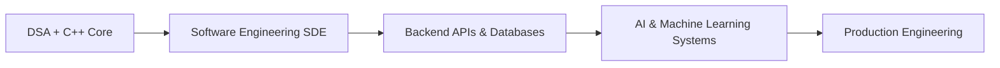

<div align="center">


# Tanmay Mangal


<p align="center">
  <a href="https://www.linkedin.com/in/tanmaymangal/">
    
  </a>
  <a href="https://leetcode.com/u/tanmay-alpha/">
    
  </a>
  <a href="mailto:mangaltanmay7@gmail.com">
    
  </a>
  <a href="https://github.com/tanmay-alpha?tab=repositories">
    
  </a>
  <a href="https://tanmay-portfolio-coral.vercel.app/">
    
  </a>
</p>

<p align="center">
  <a href="https://github.com/tanmay-alpha">
    
  </a>
  <a href="https://github.com/tanmay-alpha">
    
  </a>
  <a href="https://github.com/tanmay-alpha?tab=repositories">
    
  </a>
</p>

</div>

---

## 👨‍💻 Developer Identity

```txt
Name        : Tanmay Mangal
Role        : Computer Science Student + Software Development Engineer (SDE)
Focus       : Artificial Intelligence, Machine Learning, Scalable Backend APIs & Distributed Systems
Tech Stack  : C++, Python, Next.js, FastAPI, Java (Spring Boot), WebAssembly, PostgreSQL, Supabase
Target      : SDE / AI-ML Engineering Roles & Production Software Systems
Mindset     : Solve complex engineering problems with high-performance, maintainable architecture
```

---

## 🎯 About Me

I am a **Computer Science student** and **Software Development Engineer (SDE)** specializing in backend engineering, machine learning pipelines, and modern full-stack web architectures.

- 🧠 **AI & ML Systems**: Building semantic code analyzers, deep learning inference engines (ONNX/WASM), and computer vision applications from scratch.
- ⚡ **Backend & Distributed Systems**: Designing scalable REST APIs, WebSocket streaming servers, and worker services using FastAPI, Node.js, and Java Spring Boot.
- 🛠️ **Languages & Data**: Highly proficient in **C++, Python, JavaScript/TypeScript, Java, and SQL/NoSQL databases**.
- 🚀 **Goals**: Looking for **SDE, Backend Engineering, or AI/ML Internships & Full-Time Roles** to contribute to high-impact production environments.

---

## 🛠️ Technical Stack

### 💻 Core Languages & Runtimes
<p>
  <a href="https://skillicons.dev">
    
  </a>
</p>

### 🌐 Frontend & Web Engineering
<p>
  <a href="https://skillicons.dev">
    
  </a>
</p>

### ⚙️ Backend, Databases & Infrastructure
<p>
  <a href="https://skillicons.dev">
    
  </a>
</p>

### ☁️ DevOps & Cloud Tooling
<p>
  <a href="https://skillicons.dev">
    
  </a>
</p>

### 🤖 AI, ML & Specialized Ecosystem
<p>
  
  
  
  
  
  
  
  
</p>

---

## 🌌 Project Universe

### 🔍 Core Engineering & AI Platforms

<table>
<tr>
<td width="50%" valign="top">

### 🛡️ CodeLens
> **Semantic Automated Code Reviewer**
* Scans repositories to detect deep architectural bugs missed by standard linters (N+1 queries, hardcoded secrets, async I/O bottlenecks).
* Powered by a fine-tuned CodeBERT model for semantic code comprehension.
* Java 21 Spring Boot core worker managing queues via Redis, exposing a FastAPI inference microservice backed by PostgreSQL.

**Tech:** `Java 21` `Spring Boot` `FastAPI` `CodeBERT` `Redis` `PostgreSQL`

🔗 [Repository](https://github.com/tanmay-alpha/codelens)

</td>
<td width="50%" valign="top">

### ⚙️ Crucible
> **From-Scratch Neural Network Inference Engine**
* Implements ONNX tensor operations, model parsing, and computation graphs from scratch in C++17 and Rust.
* Compiles to WebAssembly (WASM) for zero-dependency client-side ML inside the browser.
* Includes Python bindings and a FastAPI service wrapper for backend evaluation.

**Tech:** `C++17` `Rust` `WebAssembly` `ONNX` `FastAPI`

🔗 [Repository](https://github.com/tanmay-alpha/Crucible)

</td>
</tr>

<tr>
<td width="50%" valign="top">

### 🕵️ AI Image Forensic Screener
> **Deepfake & Metadata Forensics Tool**
* Performs automated image classification using fine-tuned Hugging Face vision models.
* Audits EXIF, XMP, IPTC, and C2PA provenance metadata alongside OpenCV ELA (Error Level Analysis).
* Features a desktop GUI built with PyQt6 and SQLite report logging.

**Tech:** `Python` `PyQt6` `Hugging Face` `OpenCV` `SQLite`

🔗 [Repository](https://github.com/tanmay-alpha/AI-Image-Forensic-Screener)

</td>
<td width="50%" valign="top">

### 💳 Lumint
> **AI Payment Fraud Detection Platform**
* Uses computer vision models to inspect payment receipts, flag tampered screenshots, and detect value manipulation.
* Designed for privacy-first digital payment rails and UPI transaction safety.
* Includes a Next.js dashboard with instant risk scoring and explainable flags.

**Tech:** `Next.js` `TypeScript` `Python` `Vision AI`

🔗 [Repository](https://github.com/tanmay-alpha/Lumint) | 🌐 [Live Demo](https://lumint-pi.vercel.app)

</td>
</tr>
</table>

### 📊 Financial Systems & Analytics Terminals

<table>
<tr>
<td width="50%" valign="top">

### 📈 TradeVed Screener
> **Equity Research & Financial Screener**
* Aggregates multi-year corporate fundamental data, key ratios, and market sheets.
* Supabase integration for low-latency live reads alongside Google BigQuery for historical backtests.

**Tech:** `Next.js` `Supabase` `Google BigQuery` `TypeScript`

🔗 [Repository](https://github.com/tanmay-alpha/tradeved-screener) | 🌐 [Live Demo](https://tradevedscreener.vercel.app)

</td>
<td width="50%" valign="top">

### 📈 Indian Algo Trading Platform
> **Paper Trading Workspace & Analytics Terminal**
* High-fidelity Paper OMS for simulated execution with live market data streaming over WebSockets.
* Next.js frontend paired with a FastAPI microservice for advisory setup generation.

**Tech:** `Next.js` `FastAPI` `WebSockets` `Paper OMS`

🔗 [Repository](https://github.com/tanmay-alpha/indian-algo-trading-platform) | 🌐 [Live Demo](https://indian-algo-trading-platform.vercel.app)

</td>
</tr>

<tr>
<td width="50%" valign="top">

### 🧮 FinCalc India
> **Investor & Income Tax Calculator Suite**
* Localized tools for SIP, Lumpsum, EMI, FD, PPF, and Indian Income Tax planning.
* Native Lakhs & Crores formatting with interactive Recharts visualizations.

**Tech:** `Next.js` `TypeScript` `Tailwind CSS` `Recharts`

🔗 [Repository](https://github.com/tanmay-alpha/fincalc-india) | 🌐 [Live Demo](https://fincalc-india.vercel.app)

</td>
<td width="50%" valign="top">

### ⚡ MAET
> **Market Intelligence & Screener Terminal**
* Screens the active NSE stock universe with custom technical indicators and real-time overlays.
* High-performance FastAPI engine paired with Supabase and deployed on Render.

**Tech:** `React` `FastAPI` `Supabase` `Render`

🔗 [Repository](https://github.com/tanmay-alpha/MAET) | 🌐 [Live Demo](https://maet-pi.vercel.app)

</td>
</tr>
</table>

### 🌐 Web Applications & Tooling

<table>
<tr>
<td width="50%" valign="top">

### 📅 FOSSEE Workshop Booking
* Responsive workshop platform built with React, Vite, and Tailwind CSS.
* 🔗 [Repository](https://github.com/tanmay-alpha/fossee-workshop-booking) | 🌐 [Live Demo](https://fossee-workshop-platform.vercel.app)

</td>
<td width="50%" valign="top">

### 💻 Personal Portfolio
* Portfolio built with Next.js 15, TypeScript, Tailwind, and Framer Motion.
* 🔗 [Repository](https://github.com/tanmay-alpha/tanmay-portfolio) | 🌐 [Live Demo](https://tanmay-portfolio-coral.vercel.app/)

</td>
</tr>

<tr>
<td width="50%" valign="top">

### 🌐 Dynamic Bubble Website
* Interactive agency template built with standard HTML5, CSS3, and JavaScript.
* 🔗 [Repository](https://github.com/tanmay-alpha/Dynamic-Bubble-Website)

</td>
<td width="50%" valign="top">

### 🛠️ AI Workspace
* Production playbooks, PowerShell scripts, and CI/CD tools for AI-assisted engineering.
* 🔗 [Repository](https://github.com/tanmay-alpha/ai-workspace)

</td>
</tr>
</table>

---

## 🏆 Problem Solving

<div align="center">

<a href="https://leetcode.com/u/tanmay-alpha/">
  
</a>

</div>

---

## 📈 GitHub Activity & Performance Metrics

<div align="center">

  <a href="https://github.com/tanmay-alpha">
    
  </a>
  <a href="https://github.com/tanmay-alpha">
    
  </a>

</div>

<br/>

<div align="center">

  <a href="https://github.com/tanmay-alpha">
    
  </a>

</div>

<br/>

<div align="center">

  <a href="https://github.com/tanmay-alpha">
    
  </a>

</div>

---

## 🗺️ Engineering Path



---

## 📬 Connect With Me

<div align="center">

<a href="https://www.linkedin.com/in/tanmaymangal/">
  
</a>
<a href="https://leetcode.com/u/tanmay-alpha/">
  
</a>
<a href="mailto:mangaltanmay7@gmail.com">
  
</a>
<a href="https://github.com/tanmay-alpha?tab=repositories">
  
</a>
<a href="https://tanmay-portfolio-coral.vercel.app/">
  
</a>

</div>

---

<div align="center">

*“Building scalable software, deploying intelligent models, and solving core problems every day.”*


</div>
