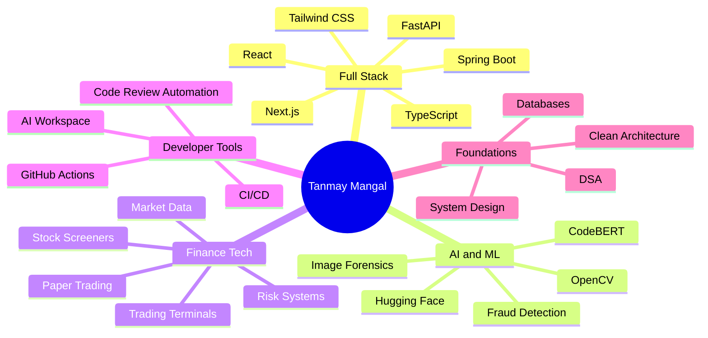
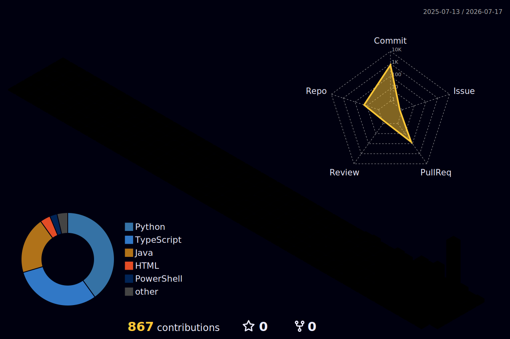
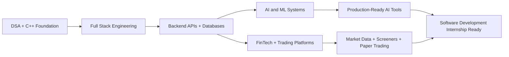

<div align="center">


# Hey, I'm Tanmay Mangal 👋


<br/>

<p>
  <a href="https://www.linkedin.com/in/tanmaymangal/">
    
  </a>
  <a href="https://leetcode.com/u/tanmay-alpha/">
    
  </a>
  <a href="mailto:mangaltanmay7@gmail.com">
    
  </a>
  <a href="https://github.com/tanmay-alpha?tab=repositories">
    
  </a>
</p>

<p>
  
  
  
</p>

</div>

---

## ⚡ Developer Identity

```txt
Name        : Tanmay Mangal
Role        : B.Tech Student + Full Stack Developer
Focus       : AI, FinTech, Trading Systems, Developer Tools, Automation
Currently   : DSA + React/Next.js + Backend + FastAPI + System Design
Goal        : Software Development Internship + Strong Project Portfolio
Mindset     : Build practical products, ship clean code, improve every day
```

---

## 💫 About Me

I am a **B.Tech student** and **full-stack developer** focused on building practical, useful, and technically strong software products.

I am currently exploring **Full Stack Development, AI/ML, Finance Technology, Trading Systems, System Design, Data Structures & Algorithms, and Developer Tools**.

- 🔭 Building **AI, fintech, trading systems, automation, and full-stack web projects**
- 🌱 Learning **DSA, React, Next.js, Backend Development, FastAPI, and System Design**
- 🧠 Interested in **AI products, developer tooling, financial platforms, and scalable systems**
- 📈 Strong interest in **stock market technology, screeners, paper trading, and data platforms**
- 🤝 Open to collaboration on **open-source, AI tools, finance platforms, and web applications**
- 🎯 Goal: Become ready for **software development internships**
- 📫 Reach me at: **mangaltanmay7@gmail.com**

---

## 🧬 My Build DNA



---

## 🚀 Main Project Universe

<table>
<tr>
<td width="50%">

### 🔍 Lumint

AI-powered fraud detection platform for India's digital payment ecosystem.

**What it does**
- Detects suspicious screenshots, documents, and links
- Produces risk score and plain-English explanation
- Built around payment-fraud awareness
- Focuses on privacy and open-source accessibility

**Tech Stack**


<br/>

🔗 [Repository](https://github.com/tanmay-alpha/Lumint)  
🌐 [Live Demo](https://lumint-pi.vercel.app)

</td>
<td width="50%">

### 📊 TradeVed Screener

Data-first Indian stock screener focused on building a serious equity research database.

**What it does**
- Indian equity research and screening
- Company master data, prices, fundamentals, ratios
- Supabase for live reads
- BigQuery for analytics, history, audits, and backtesting direction

**Tech Stack**


<br/>

🔗 [Repository](https://github.com/tanmay-alpha/tradeved-screener)  
🌐 [Live Demo](https://tradevedscreener.vercel.app)

</td>
</tr>

<tr>
<td width="50%">

### 📈 MAET

Scanner-first Indian market intelligence terminal for shortlisting NSE stocks.

**What it does**
- NSE company universe support
- Stock scanner and filters
- Charts, indicators, market data
- Supabase database and Render backend direction

**Tech Stack**


<br/>

🔗 [Repository](https://github.com/tanmay-alpha/MAET)  
🌐 [Live Demo](https://maet-pi.vercel.app)

</td>
<td width="50%">

### 🧠 Indian Algo Trading Platform

Safety-first Indian market analytics and paper trading workspace.

**What it does**
- Market analytics terminal
- Paper OMS and dry-run order validation
- Read-only broker context
- AI advisory notes
- Live execution locked for safety

**Tech Stack**


<br/>

🔗 [Repository](https://github.com/tanmay-alpha/indian-algo-trading-platform)  
🌐 [Live Demo](https://indian-algo-trading-platform.vercel.app)

</td>
</tr>

<tr>
<td width="50%">

### 🧮 FinCalc India

Financial calculator suite for Indian investors and tax filers.

**What it does**
- SIP calculator
- EMI calculator
- FD calculator
- PPF calculator
- Lumpsum calculator
- Income tax calculator

**Tech Stack**


<br/>

🔗 [Repository](https://github.com/tanmay-alpha/fincalc-india)  
🌐 [Live Demo](https://fincalc-india.vercel.app)

</td>
<td width="50%">

### 🖼️ AI Image Forensic Screener

Desktop tool for detecting AI-generated and deepfake images.

**What it does**
- ML-based image detection
- EXIF, XMP, IPTC metadata analysis
- C2PA provenance support
- Exportable forensic reports
- SQLite scan history

**Tech Stack**


<br/>

🔗 [Repository](https://github.com/tanmay-alpha/AI-Image-Forensic-Screener)

</td>
</tr>

<tr>
<td width="50%">

### 🔎 CodeLens

Semantic automated code review system powered by fine-tuned CodeBERT.

**What it does**
- Detects bugs missed by normal linters
- Finds N+1 query patterns
- Detects hardcoded secrets
- Flags sync I/O inside async paths
- Supports dashboard, VS Code, and GitHub Action surfaces

**Tech Stack**


<br/>

🔗 [Repository](https://github.com/tanmay-alpha/codelens)

</td>
<td width="50%">

### 🔥 Crucible

From-scratch ONNX inference engine in C++17.

**What it does**
- Lightweight ONNX inference engine
- Browser inference through WebAssembly
- No Python required at runtime
- Rust CLI, Python bindings, FastAPI server, WASM surface

**Tech Stack**


<br/>

🔗 [Repository](https://github.com/tanmay-alpha/Crucible)

</td>
</tr>
</table>

---

## 🌐 Web, Portfolio & Tooling Projects

<table>
<tr>
<td width="50%">

### 🎓 FOSSEE Workshop Booking

Responsive workshop booking interface built with React.

**Tech:** React, Vite, Tailwind CSS, React Router

🔗 [Repository](https://github.com/tanmay-alpha/fossee-workshop-booking)  
🌐 [Live Demo](https://fossee-workshop-platform.vercel.app)

</td>
<td width="50%">

### 🧑‍💻 Personal Portfolio

Modern personal portfolio website.

**Tech:** Next.js 15, TypeScript, Tailwind CSS, Framer Motion

🔗 [Repository](https://github.com/tanmay-alpha/tanmay-portfolio)

</td>
</tr>

<tr>
<td width="50%">

### ⚡ Dynamic Bubble Website

Responsive digital services agency website template.

**Tech:** HTML5, CSS3, JavaScript

🔗 [Repository](https://github.com/tanmay-alpha/Dynamic-Bubble-Website)

</td>
<td width="50%">

### 🧰 AI Workspace

Reusable workflow toolkit for AI-assisted software engineering.

**Tech:** PowerShell, CI/CD, GitHub Actions, Prompt Playbooks, Developer Workflow

🔗 [Repository](https://github.com/tanmay-alpha/-ai-workspace)

</td>
</tr>
</table>

---

## 🛠️ Skills Arsenal

<div align="center">

### Core Languages


<br/><br/>

### Frontend Engineering


<br/><br/>

### Backend Engineering


<br/><br/>

### Databases, Cloud & Infra


<br/><br/>

### AI, Data, Finance & Specialized Tools


</div>

---

## 🧠 Learning Radar

<table>
<tr>
<td><b>DSA in C++</b></td>
<td>█████████░░░░░░░</td>
<td>45%</td>
</tr>
<tr>
<td><b>React & Next.js</b></td>
<td>████████░░░░░░░░</td>
<td>40%</td>
</tr>
<tr>
<td><b>Backend Engineering</b></td>
<td>███████░░░░░░░░░</td>
<td>35%</td>
</tr>
<tr>
<td><b>FastAPI + APIs</b></td>
<td>███████░░░░░░░░░</td>
<td>35%</td>
</tr>
<tr>
<td><b>System Design</b></td>
<td>█████░░░░░░░░░░░</td>
<td>25%</td>
</tr>
<tr>
<td><b>AI/ML Project Development</b></td>
<td>██████░░░░░░░░░░</td>
<td>30%</td>
</tr>
<tr>
<td><b>Finance Technology</b></td>
<td>███████░░░░░░░░░</td>
<td>35%</td>
</tr>
</table>

---

## 🧠 Problem Solving

<div align="center">

<a href="https://leetcode.com/u/tanmay-alpha/">
  
</a>

</div>

---

## 📊 Live GitHub Stats

<div align="center">


</div>

<br/>

<div align="center">


</div>

<br/>

<div align="center">


</div>

---

## 🌌 3D Contribution Universe

<div align="center">



</div>

---

## 🏆 GitHub Trophies

<div align="center">


</div>

---

## 🧩 Engineering Direction



---

## 🌐 Connect With Me

<div align="center">

<a href="https://www.linkedin.com/in/tanmaymangal/">
  
</a>
<a href="https://leetcode.com/u/tanmay-alpha/">
  
</a>
<a href="mailto:mangaltanmay7@gmail.com">
  
</a>
<a href="https://github.com/tanmay-alpha?tab=repositories">
  
</a>

</div>

---

<div align="center">

### “Building projects, solving problems, and improving every day.”


</div>
