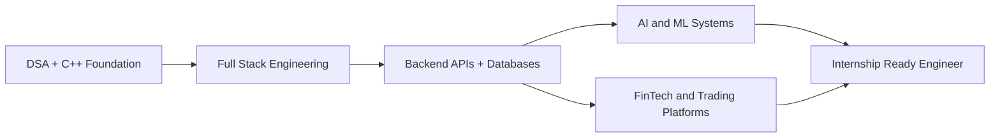

<div align="center">


# Tanmay Mangal


<p>
  <a href="https://www.linkedin.com/in/tanmaymangal/">
    
  </a>
  <a href="https://leetcode.com/u/tanmay-alpha/">
    
  </a>
  <a href="mailto:mangaltanmay7@gmail.com">
    
  </a>
  <a href="https://github.com/tanmay-alpha?tab=repositories">
    
  </a>
  <a href="https://tanmay-portfolio-coral.vercel.app/">
    
  </a>
</p>

<p>
  <a href="https://github.com/tanmay-alpha">
    
  </a>
  <a href="https://github.com/tanmay-alpha">
    
  </a>
  <a href="https://github.com/tanmay-alpha?tab=repositories">
    
  </a>
</p>

</div>

---

## Developer Identity

```txt
Name        : Tanmay Mangal
Role        : B.Tech Student + Full Stack Developer
Focus       : AI, FinTech, Trading Systems, Developer Tools, Automation
Currently   : DSA + React/Next.js + Backend + FastAPI + System Design
Goal        : Software Development Internship + Strong Project Portfolio
Mindset     : Build practical products, ship clean code, improve every day
```

---

## About Me

I am a **B.Tech student** and **full-stack developer** building practical, production-grade software. Not toy projects — real platforms with real architecture.

- Building **AI, FinTech, trading systems, automation, and full-stack web products** from scratch
- Exploring **stock screeners, market data pipelines, paper trading, and risk systems** as core domains
- Learning **DSA in C++, React/Next.js, FastAPI, system design, and backend engineering**
- Strong interest in **AI/ML applications, developer tooling, financial platforms, and scalable APIs**
- Open to **internships, collaborations, and open-source contributions** in AI, FinTech, or full-stack

---

## Quant Skill Reactor

<div align="center">



</div>

---

## AI Market Intelligence Terminal

<div align="center">



</div>

---

## Technical Skills

<details open>
  <summary><b>💻 Programming Languages</b></summary>
  <br/>
  <table>
    <tr>
      <td align="center" width="85"><br/>C++</td>
      <td align="center" width="85"><br/>Python</td>
      <td align="center" width="85"><br/>Java</td>
      <td align="center" width="85"><br/>JavaScript</td>
      <td align="center" width="85"><br/>TypeScript</td>
      <td align="center" width="85"><br/>Rust</td>
    </tr>
    <tr>
      <td align="center" width="85"><br/>Bash</td>
      <td align="center" width="85"><br/>PowerShell</td>
    </tr>
  </table>
</details>

<details open>
  <summary><b>🌐 Frontend Development</b></summary>
  <br/>
  <table>
    <tr>
      <td align="center" width="85"><br/>React</td>
      <td align="center" width="85"><br/>Next.js</td>
      <td align="center" width="85"><br/>Redux</td>
      <td align="center" width="85"><br/>Tailwind CSS</td>
      <td align="center" width="85"><br/>Vite</td>
      <td align="center" width="85"><br/>Figma</td>
    </tr>
    <tr>
      <td align="center" width="85"><br/>HTML5</td>
      <td align="center" width="85"><br/>CSS3</td>
    </tr>
  </table>
</details>

<details open>
  <summary><b>⚙️ Backend and Databases</b></summary>
  <br/>
  <table>
    <tr>
      <td align="center" width="85"><br/>FastAPI</td>
      <td align="center" width="85"><br/>Node.js</td>
      <td align="center" width="85"><br/>Spring</td>
      <td align="center" width="85"><br/>Express.js</td>
      <td align="center" width="85"><br/>Flask</td>
      <td align="center" width="85"><br/>PostgreSQL</td>
    </tr>
    <tr>
      <td align="center" width="85"><br/>MySQL</td>
      <td align="center" width="85"><br/>MongoDB</td>
      <td align="center" width="85"><br/>SQLite</td>
      <td align="center" width="85"><br/>Supabase</td>
      <td align="center" width="85"><br/>Redis</td>
    </tr>
  </table>
</details>

<details open>
  <summary><b>☁️ DevOps, Cloud and Tooling</b></summary>
  <br/>
  <table>
    <tr>
      <td align="center" width="85"><br/>Docker</td>
      <td align="center" width="85"><br/>AWS</td>
      <td align="center" width="85"><br/>Vercel</td>
      <td align="center" width="85"><br/>GitHub</td>
      <td align="center" width="85"><br/>Git</td>
      <td align="center" width="85"><br/>Linux</td>
    </tr>
    <tr>
      <td align="center" width="85"><br/>Nginx</td>
    </tr>
  </table>
</details>

<details open>
  <summary><b>📈 AI, Machine Learning and Specialized Tools</b></summary>
  <br/>
  <table>
    <tr>
      <td align="center" width="95"><br/>Hugging Face</td>
      <td align="center" width="95"><br/>OpenCV</td>
      <td align="center" width="95"><br/>PyQt6</td>
      <td align="center" width="95"><br/>WebSocket</td>
      <td align="center" width="95"><br/>BigQuery</td>
      <td align="center" width="95"><br/>Render</td>
    </tr>
    <tr>
      <td align="center" width="95"><br/>Recharts</td>
      <td align="center" width="95"><br/>Zod</td>
      <td align="center" width="95"><br/>Prisma</td>
      <td align="center" width="95"><br/>Framer Motion</td>
      <td align="center" width="95"><br/>WebAssembly</td>
      <td align="center" width="95"><br/>ONNX</td>
    </tr>
  </table>
</details>

---

## Main Project Universe

<table>
<tr>
<td width="50%">

### Lumint

AI-powered payment fraud detection platform built to secure transactions.

**What it does**
- Detects tampered payment screenshots and manipulated values using ML/AI computer vision
- Performs instant risk analysis on transaction receipts and flags suspicious domains
- Built around open-source, privacy-first UPI fraud mitigation for India's digital payment rails
- Provides a clean dashboard with risk scoring and plain-English explanations of flagged items

**Tech Stack**


<br/>

[Repository](https://github.com/tanmay-alpha/Lumint) | [Live Demo](https://lumint-pi.vercel.app)

</td>
<td width="50%">

### TradeVed Screener

Data-first Indian equity research database and fundamental stock screener.

**What it does**
- Aggregates multi-year corporate fundamental data, financial ratios, and master sheets
- Utilizes Supabase for low-latency live reads and user watchlists
- Integrates Google BigQuery data warehouse for intensive historical analytics, data audits, and screener backtests
- Supports complex query building across dynamic financial metrics

**Tech Stack**


<br/>

[Repository](https://github.com/tanmay-alpha/tradeved-screener) | [Live Demo](https://tradevedscreener.vercel.app)

</td>
</tr>

<tr>
<td width="50%">

### MAET

Scanner-first Indian market intelligence and stock discovery terminal.

**What it does**
- Tracks the active NSE company universe with multi-metric screening filters
- Processes and displays real-time price indicators and custom chart overlays
- Combines a FastAPI backend for high-performance calculations with a Supabase database
- Deployed on Render for fast API response times under high-frequency updates

**Tech Stack**


<br/>

[Repository](https://github.com/tanmay-alpha/MAET) | [Live Demo](https://maet-pi.vercel.app)

</td>
<td width="50%">

### Indian Algo Trading Platform

Safety-first market analytics terminal and simulated paper trading workspace.

**What it does**
- Features a high-fidelity Paper OMS (Order Management System) to practice execution safely
- Streams real-time market data directly from broker contexts using high-speed WebSockets
- Includes AI advisory note generation to assist with trade setup planning
- Built with Next.js and a fast FastAPI server, locking live execution for safe dry-runs

**Tech Stack**


<br/>

[Repository](https://github.com/tanmay-alpha/indian-algo-trading-platform) | [Live Demo](https://indian-algo-trading-platform.vercel.app)

</td>
</tr>

<tr>
<td width="50%">

### FinCalc India

Comprehensive calculator suite localized for Indian investment and tax planning.

**What it does**
- Provides localized tools for SIP, Lumpsum, EMI, FD, PPF, and detailed Income Tax calculations
- Fully supports Indian number formatting conventions (Lakhs and Crores)
- Features interactive, clean data visualization dashboards built with Recharts
- Fast, ad-free alternative optimized for everyday investor and tax filer calculations

**Tech Stack**


<br/>

[Repository](https://github.com/tanmay-alpha/fincalc-india) | [Live Demo](https://fincalc-india.vercel.app)

</td>
<td width="50%">

### AI Image Forensic Screener

Desktop intelligence tool for deepfake detection and metadata forensic inspection.

**What it does**
- Performs image classification using fine-tuned Hugging Face ML models
- Extracts and audits EXIF, XMP, IPTC, and modern C2PA provenance metadata
- Applies OpenCV filters for digital image forensics (error level and noise analysis)
- Features a secure PyQt6 desktop GUI with local SQLite history logging and report exports

**Tech Stack**


<br/>

[Repository](https://github.com/tanmay-alpha/AI-Image-Forensic-Screener)

</td>
</tr>

<tr>
<td width="50%">

### CodeLens

Semantic automated code reviewer designed to identify deep architectural bugs.

**What it does**
- Scans repositories to detect issues missed by standard linters (N+1 queries, hardcoded secrets, I/O in async paths)
- Employs a fine-tuned CodeBERT model for deep semantic code comprehension
- Built as a Java 21 Spring Boot core worker service managing task queues via Redis
- Exposes a high-performance FastAPI server for model inference, logging to PostgreSQL

**Tech Stack**


<br/>

[Repository](https://github.com/tanmay-alpha/codelens)

</td>
<td width="50%">

### Crucible

From-scratch high-performance neural network inference engine.

**What it does**
- Implements ONNX tensor operations, model parsing, and computation graphs from scratch
- Written in clean, modular C++17 with supplementary implementations in Rust
- Compiles via WebAssembly (WASM) to support zero-dependency client-side ML in the browser
- Includes Python bindings and a FastAPI wrapper for backend testing

**Tech Stack**


<br/>

[Repository](https://github.com/tanmay-alpha/Crucible)

</td>
</tr>
</table>

---

## Web, Portfolio and Tooling Projects

<table>
<tr>
<td width="50%">

### FOSSEE Workshop Booking

Responsive workshop booking interface built with React.

**Tech:** React, Vite, Tailwind CSS, React Router

[Repository](https://github.com/tanmay-alpha/fossee-workshop-booking) | [Live Demo](https://fossee-workshop-platform.vercel.app)

</td>
<td width="50%">

### Personal Portfolio

Modern personal portfolio website.

**Tech:** Next.js 15, TypeScript, Tailwind CSS, Framer Motion

[Repository](https://github.com/tanmay-alpha/tanmay-portfolio) | [Live Demo](https://tanmay-portfolio-coral.vercel.app/)

</td>
</tr>

<tr>
<td width="50%">

### Dynamic Bubble Website

Responsive digital services agency website template.

**Tech:** HTML5, CSS3, JavaScript

[Repository](https://github.com/tanmay-alpha/Dynamic-Bubble-Website)

</td>
<td width="50%">

### AI Workspace

Reusable workflow toolkit for AI-assisted software engineering.

**Tech:** PowerShell, CI/CD, GitHub Actions, Prompt Playbooks

[Repository](https://github.com/tanmay-alpha/-ai-workspace)

</td>
</tr>
</table>

---

## Project Radar

<div align="center">



</div>

---

## Learning Radar

<table>
<tr>
<td><b>DSA in C++</b></td>
<td>█████████░░░░░░░</td>
<td>45%</td>
</tr>
<tr>
<td><b>React and Next.js</b></td>
<td>████████░░░░░░░░</td>
<td>40%</td>
</tr>
<tr>
<td><b>Backend Engineering</b></td>
<td>███████░░░░░░░░░</td>
<td>35%</td>
</tr>
<tr>
<td><b>FastAPI and APIs</b></td>
<td>███████░░░░░░░░░</td>
<td>35%</td>
</tr>
<tr>
<td><b>System Design</b></td>
<td>█████░░░░░░░░░░░</td>
<td>25%</td>
</tr>
<tr>
<td><b>AI/ML Project Development</b></td>
<td>██████░░░░░░░░░░</td>
<td>30%</td>
</tr>
<tr>
<td><b>Finance Technology</b></td>
<td>███████░░░░░░░░░</td>
<td>35%</td>
</tr>
</table>

---

## Problem Solving

<div align="center">

<a href="https://leetcode.com/u/tanmay-alpha/">
  
</a>

</div>

---

## GitHub Statistics

<div align="center">
  <!-- General Stats Card & Streak Stats Card side-by-side -->
  <a href="https://github.com/tanmay-alpha">
    
  </a>
  <a href="https://github.com/tanmay-alpha">
    
  </a>
</div>

<br/>

<div align="center">
  <!-- 31-Day Activity Consistency Graph -->
  <a href="https://github.com/tanmay-alpha">
    
  </a>
</div>

<br/>

<div align="center">
  <!-- Language Distribution Summary Cards -->
  
  
</div>

---

## 3D Contribution Universe

<div align="center">


</div>

---

## Engineering Direction



---

## Connect With Me

<div align="center">

<a href="https://www.linkedin.com/in/tanmaymangal/">
  
</a>
<a href="https://leetcode.com/u/tanmay-alpha/">
  
</a>
<a href="mailto:mangaltanmay7@gmail.com">
  
</a>
<a href="https://github.com/tanmay-alpha?tab=repositories">
  
</a>
<a href="https://tanmay-portfolio-coral.vercel.app/">
  
</a>

</div>

---

<div align="center">

### "Building products, decoding markets, training models, and improving every day."


</div>
