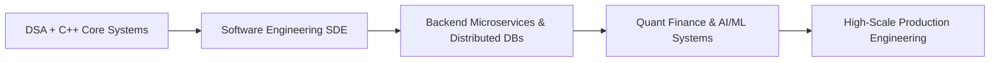

<div align="center">


# Tanmay Mangal


<p align="center">
  <a href="https://www.linkedin.com/in/tanmaymangal/">
    
  </a>
  <a href="https://leetcode.com/u/tanmay-alpha/">
    
  </a>
  <a href="mailto:mangaltanmay7@gmail.com">
    
  </a>
  <a href="https://github.com/tanmay-alpha?tab=repositories">
    
  </a>
  <a href="https://tanmay-portfolio-coral.vercel.app/">
    
  </a>
</p>

<p align="center">
  <a href="https://github.com/tanmay-alpha">
    
  </a>
  <a href="https://github.com/tanmay-alpha">
    
  </a>
  <a href="https://github.com/tanmay-alpha?tab=repositories">
    
  </a>
</p>

</div>

---

## 👨‍💻 Developer Identity

```txt
Name        : Tanmay Mangal
Role        : Computer Science Student + Software Development Engineer (SDE)
Focus       : Quantitative Finance, Deep Learning Inference, Scalable Backend Systems & Tooling
Core Stack  : C++, Python, TypeScript, Java (Spring Boot), Next.js 15, FastAPI, PostgreSQL
Location    : India
GitHub      : https://github.com/tanmay-alpha
Portfolio   : https://tanmay-portfolio-coral.vercel.app
```

I am a **Computer Science student** and **Software Development Engineer (SDE)** specializing in high-performance system architectures, quantitative analytics engines, machine learning inference runtimes, and full-stack enterprise web platforms.

---

## 🛠️ Tech Stack & Technical Skills

<div align="center">

### 💻 Languages & Core Systems
<p align="center">
  
</p>

### ⚙️ Frameworks & Backends
<p align="center">
  
</p>

### ☁️ Infrastructure & Tools
<p align="center">
  
</p>

</div>

---

## ⚡ Featured Systems & Production Projects

<table>
<tr>
<td width="50%" valign="top">

### 🤖 Automated Code Review Tool
> **Enterprise Microservices & ML Code Audit Platform**
* **Focus**: Automated static analysis, secret redaction, and deep learning classification.
* **Architecture**: Distributed multi-service architecture with a Java Spring Boot API gateway, FastAPI ML classification worker, PostgreSQL transactional outbox pattern, and an integrated VS Code extension for inline developer feedback.

**Tech:** `Java Spring Boot` `FastAPI` `PyTorch` `PostgreSQL` `VS Code API` `Docker`

🔗 [Repository](https://github.com/tanmay-alpha/automated-code-review-tool)

</td>
<td width="50%" valign="top">

### ✈️ Flight Agent Evaluator
> **Deterministic Agent Benchmark & Aviation Environment**
* **Focus**: Reliability evaluation for LLM autonomous agents in complex flight booking domain.
* **Architecture**: Production evaluation harness providing deterministic HTTP recording/replay, multi-stage constraint verification, stateful simulated airline API environments, and automated diagnostic scorecards across model providers.

**Tech:** `Python` `FastAPI` `Pydantic` `HTTP Replay` `Pytest` `CLI`

🔗 [Repository](https://github.com/tanmay-alpha/Flight-Agent-Evaluator)

</td>
</tr>

<tr>
<td width="50%" valign="top">

### 🚀 ONNX Inference Engine
> **High-Performance C++ Deep Learning Inference Core**
* **Focus**: Zero-overhead neural network operator execution and tensor graph dispatch.
* **Architecture**: Custom C++20 deep learning execution runtime implementing 20 ONNX operators, PyBind11 Python bindings, C ABI shared library export, Rust CLI tools, and Google Benchmark performance suites.

**Tech:** `C++20` `PyBind11` `Rust` `ONNX` `Google Benchmark` `CMake`

🔗 [Repository](https://github.com/tanmay-alpha/onnx-inference-engine)

</td>
<td width="50%" valign="top">

### 📈 MAET
> **Market Analytics & Execution Terminal**
* **Focus**: High-speed equity screening and market intelligence.
* **Architecture**: Intelligence terminal for shortlisting NSE equities using corporate fundamental data, real-time price feeds, custom technical filters, and database-backed screening pipelines powered by FastAPI, Supabase PostgreSQL, and Render.

**Tech:** `React` `FastAPI` `Supabase` `PostgreSQL` `Render` `Tailwind CSS`

🔗 [Repository](https://github.com/tanmay-alpha/MAET) | 🌐 [Live Demo](https://maet-pi.vercel.app)

</td>
</tr>

<tr>
<td width="50%" valign="top">

### 📉 Indian Algo Trading Platform
> **Paper Trading Workspace & Execution OMS**
* **Focus**: High-fidelity simulated trading & market analytics.
* **Architecture**: Paper OMS workspace for Indian equity (NSE) markets. Features real-time market data streaming over WebSockets, interactive candle diagnostics, dry-run order validation, OMS reconciliation tracking, and an integrated FastAPI microservice.

**Tech:** `Next.js 15` `FastAPI` `WebSockets` `Paper OMS` `TypeScript` `Tailwind CSS`

🔗 [Repository](https://github.com/tanmay-alpha/indian-algo-trading-platform) | 🌐 [Live Demo](https://indian-algo-trading-platform.vercel.app)

</td>
<td width="50%" valign="top">

### 🧮 FinCalc India
> **Investor & Income Tax Calculator Suite**
* **Focus**: Financial tools localized for the Indian demographic.
* **Architecture**: Production-ready financial calculator suite covering SIP, Lumpsum, EMI, FD, PPF, and Old vs. New Tax regime comparisons. Built with native Indian numbering (Lakhs & Crores), dynamic compounding visualizers, and interactive Recharts graphs.

**Tech:** `Next.js 15` `TypeScript` `Tailwind CSS` `Recharts`

🔗 [Repository](https://github.com/tanmay-alpha/fincalc-india) | 🌐 [Live Demo](https://fincalc-india.vercel.app)

</td>
</tr>

<tr>
<td width="50%" valign="top">

### 💻 Personal Portfolio
> **Interactive SDE Portfolio Platform**
* Personal portfolio website highlighting production projects, full-stack applications, interactive UI micro-animations, theme toggles, and live demo integrations.

**Tech:** `Next.js 15` `TypeScript` `Tailwind CSS` `Framer Motion` `Lucide Icons`

🔗 [Repository](https://github.com/tanmay-alpha/tanmay-portfolio) | 🌐 [Live Demo](https://tanmay-portfolio-coral.vercel.app)

</td>
<td width="50%" valign="top">

### 🎓 FOSSEE Workshop Booking
> **Educational Workshop Reservation Platform**
* Responsive web platform designed for managing educational workshop bookings, featuring real-time seat reservation state handling, category filtering, and instant confirmations.

**Tech:** `React 18` `Vite` `Tailwind CSS` `JavaScript`

🔗 [Repository](https://github.com/tanmay-alpha/fossee-workshop-booking) | 🌐 [Live Demo](https://fossee-workshop-platform.vercel.app)

</td>
</tr>
</table>

---

## 🏆 Problem Solving & Competitive Programming

<div align="center">

<a href="https://leetcode.com/u/tanmay-alpha/">
  
</a>

</div>

---

## 📈 GitHub Activity & Performance Metrics

<div align="center">

  <a href="https://github.com/tanmay-alpha">
    
  </a>
  <a href="https://github.com/tanmay-alpha">
    
  </a>

</div>

<br/>

<div align="center">

  <a href="https://github.com/tanmay-alpha">
    
  </a>

</div>

<br/>

<div align="center">

  <a href="https://github.com/tanmay-alpha">
    
  </a>

</div>

---

## 🗺️ Engineering Path


```mermaid
flowchart LR
    A[DSA + C++ Core Systems] --> B[Software Engineering SDE]
    B --> C[Backend Microservices & Distributed DBs]
    C --> D[Quant Finance & AI/ML Systems]
    D --> E[High-Scale Production Engineering]
```

---

## 📬 Connect With Me

<div align="center">

<a href="https://www.linkedin.com/in/tanmaymangal/">
  
</a>
<a href="https://leetcode.com/u/tanmay-alpha/">
  
</a>
<a href="mailto:mangaltanmay7@gmail.com">
  
</a>
<a href="https://github.com/tanmay-alpha?tab=repositories">
  
</a>
<a href="https://tanmay-portfolio-coral.vercel.app/">
  
</a>

</div>

---

<div align="center">

*“Building scalable software, deploying intelligent models, and solving core engineering problems every day.”*


</div>
