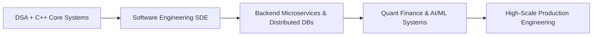

<div align="center">


# Tanmay Mangal


<p align="center">
  <a href="https://www.linkedin.com/in/tanmaymangal/">
    
  </a>
  <a href="https://leetcode.com/u/tanmay-alpha/">
    
  </a>
  <a href="mailto:mangaltanmay7@gmail.com">
    
  </a>
  <a href="https://github.com/tanmay-alpha?tab=repositories">
    
  </a>
  <a href="https://tanmay-portfolio-coral.vercel.app/">
    
  </a>
</p>

<p align="center">
  <a href="https://github.com/tanmay-alpha">
    
  </a>
  <a href="https://github.com/tanmay-alpha">
    
  </a>
  <a href="https://github.com/tanmay-alpha?tab=repositories">
    
  </a>
</p>

</div>

---

## 👨‍💻 Developer Identity

```txt
Name        : Tanmay Mangal
Role        : Computer Science Student + Software Development Engineer (SDE)
Focus       : Quantitative Finance, Deep Learning Inference, Scalable Backend Systems & Tooling
Core Stack  : C++17, Python, Next.js 15, FastAPI, Java 21 (Spring Boot), WebAssembly, PostgreSQL, Supabase
Target      : SDE / Quant Engineering / AI-ML Production Roles
Mindset     : Solve hard engineering problems with high-performance, mathematically rigorous architecture
```

---

## 🎯 About Me

I am a **Computer Science student** and **Software Development Engineer (SDE)** passionate about building production-grade software spanning **Quantitative Finance**, **AI/ML Systems**, **High-Performance Backends**, and **Modern Web Architectures**.

- 🧠 **AI & Machine Learning Systems**: Building fine-tuned CodeBERT semantic analyzers, zero-dependency C++/WASM neural network inference engines, and computer vision fraud detection suites.
- 📈 **Quantitative Finance & Algorithmic Trading**: Engineering statistical market-regime detection algorithms (IIT Bombay Summer Quant 2026), crypto backtesting frameworks, and paper-trading OMS terminals.
- ⚡ **Backend & Distributed Systems**: Architecting async microservices, WebSocket market-data streaming pipelines, and Redis job queues using Java 21 Spring Boot, FastAPI, and Next.js.
- 🚀 **Goals**: Looking for **SDE, Quant Engineering, or AI/ML Internships & Full-Time Roles** to build high-scale, impactful systems.

---

## 🛠️ Technical Stack

### 💻 Core Languages & Runtimes
<p>
  <a href="https://skillicons.dev">
    
  </a>
</p>

### 🌐 Frontend & Full-Stack Web
<p>
  <a href="https://skillicons.dev">
    
  </a>
</p>

### ⚙️ Backend, Databases & Infrastructure
<p>
  <a href="https://skillicons.dev">
    
  </a>
</p>

### ☁️ DevOps, Systems & Cloud
<p>
  <a href="https://skillicons.dev">
    
  </a>
</p>

### 🤖 AI, ML & Specialized Ecosystem
<p>
  
  
  
  
  
  
  
  
</p>

---

## 🌌 Deep Dive Project Universe

### 🤖 AI, Deep Learning & Systems Engineering

<table>
<tr>
<td width="50%" valign="top">

### 🛡️ Automated Code Review Tool
> **Semantic Code Review Engine & Multi-Service System**
* **The Problem**: Standard linters (ESLint, Pylint) check syntax but miss production-breaking semantic bugs like N+1 ORM loops, unindexed DB queries, and hardcoded secrets.
* **Architecture**: Fine-tuned CodeBERT model for semantic AST analysis. Java 21 Spring Boot core worker handles async queues via Redis, coupled with a FastAPI microservice, PostgreSQL persistence layer, Next.js web dashboard, GitHub Actions PR bot, and VS Code extension.

**Tech:** `Java 21` `Spring Boot` `FastAPI` `CodeBERT` `Redis` `PostgreSQL` `Next.js` `VS Code API`

🔗 [Repository](https://github.com/tanmay-alpha/automated-code-review-tool)

</td>
<td width="50%" valign="top">

### ⚡ ONNX Inference Engine
> **Zero-Dependency C++17 & WebAssembly Inference Engine**
* **The Problem**: Running heavy ML models client-side often requires bulky runtimes and exposes model parameters to security risks.
* **Architecture**: Custom-built neural network inference engine from scratch in C++17/Rust with no external runtime dependencies. Parses `.onnx` model graphs, executes CPU matrix operations, and compiles via WebAssembly (WASM) for zero-latency, privacy-preserving browser inference. Includes CPU latency benchmarks vs ONNX Runtime & PyTorch.

**Tech:** `C++17` `Rust` `WebAssembly` `ONNX` `FastAPI` `Next.js`

🔗 [Repository](https://github.com/tanmay-alpha/onnx-inference-engine) | 🌐 [Live App](https://crucible-ivory-three.vercel.app)

</td>
</tr>

<tr>
<td width="50%" valign="top">

### 💳 Lumint
> **AI Payment & Banking Fraud Intelligence Operating System**
* **The Problem**: Digital payment screenshot forgery and UPI transaction value manipulation bypass static OCR filters.
* **Architecture**: Open-source AI fraud detection engine inspecting payment receipts, font geometries, and transaction metadata in <3 seconds using vision models (PyTorch/OpenCV). Provides instant explainable risk scores and human-readable audit reports via a Next.js frontend.

**Tech:** `Next.js` `TypeScript` `Python` `Vision AI` `FastAPI` `PyTorch` `OpenCV`

🔗 [Repository](https://github.com/tanmay-alpha/Lumint) | 🌐 [Live Demo](https://lumint-pi.vercel.app)

</td>
<td width="50%" valign="top">

### 🕵️ AI Image Forensic Screener
> **Deepfake Detection & Digital Metadata Forensics**
* **The Problem**: Detecting sophisticated AI-generated images requires combining deep neural classification with forensic image analysis.
* **Architecture**: Desktop forensic tool leveraging fine-tuned Hugging Face vision models (EfficientNet) combined with Error Level Analysis (ELA) and EXIF/XMP/IPTC/C2PA metadata inspection. Features a automated setup (`launch_app.bat`), PyQt6 GUI, and SQLite report logging.

**Tech:** `Python` `PyQt6` `Hugging Face` `OpenCV` `SQLite` `EfficientNet`

🔗 [Repository](https://github.com/tanmay-alpha/AI-Image-Forensic-Screener)

</td>
</tr>

<tr>
<td width="50%" valign="top">

### ✈️ Flight Agent Evaluator
> **Autonomous AI Agent Evaluation Framework**
* **The Problem**: Assessing function-calling accuracy and tool selection stability in multi-step AI agents requires rigorous test harnesses.
* **Architecture**: Automated evaluation framework benchmarking LLM-powered autonomous travel agents across multi-turn decision trees, tool call parameters, constraint validations, and fallback handling routines.

**Tech:** `Python` `AI Agents` `LLM Benchmarking` `Function Calling` `Evaluation Engine`

🔗 [Repository](https://github.com/tanmay-alpha/Flight-Agent-Evaluator)

</td>
<td width="50%" valign="top">

</td>
</tr>
</table>

### 📊 Quantitative Finance & Financial Engineering

<table>
<tr>
<td width="50%" valign="top">

### 📊 RegimeShift
> **Market-Regime Dynamic Asset Allocation Engine**
* **Focus**: Quantitative portfolio management & dynamic asset allocation.
* **Architecture**: Developed for the **IIT Bombay Summer Quant 2026 Assignment** (achieved 225/225 passing unit/integration tests). Detects statistical market regime shifts (bullish, bearish, high-volatility) using statistical models, dynamically rebalances multi-asset portfolios, computes risk-parity weights, and enforces drawdown protection via a full walk-forward out-of-sample engine.

**Tech:** `Python` `Quantitative Analytics` `Walk-Forward Engine` `NumPy` `SciPy` `Pandas`

🔗 [Repository](https://github.com/tanmay-alpha/RegimeShift)

</td>
<td width="50%" valign="top">

### 📈 SatoshiFlow
> **Crypto Quantitative Trading & Backtesting Sandbox**
* **Focus**: Quantitative research, strategy validation, and backtesting.
* **Architecture**: Modular quantitative research platform for cryptocurrency time-series data. Features vectorized and event-driven backtesting engines, signal generation modules (mean-reversion, trend-following), transaction cost/slippage models, performance risk metrics (Sharpe, Sortino, Max Drawdown), and parameter grid search.

**Tech:** `Python` `Algorithmic Trading` `Vectorized Backtester` `Time-Series ML` `Pandas`

🔗 [Repository](https://github.com/tanmay-alpha/SatoshiFlow)

</td>
</tr>

<tr>
<td width="50%" valign="top">

### 📈 Indian Algo Trading Platform
> **Paper Trading Workspace & Execution OMS**
* **Focus**: High-fidelity simulated trading & market analytics.
* **Architecture**: Paper OMS workspace for Indian equity (NSE) markets. Features real-time market data streaming over WebSockets, interactive candle diagnostics, dry-run order validation, OMS reconciliation tracking, and an integrated FastAPI microservice for AI advisory setup generation.

**Tech:** `Next.js 15` `FastAPI` `WebSockets` `Paper OMS` `TypeScript` `Tailwind CSS`

🔗 [Repository](https://github.com/tanmay-alpha/indian-algo-trading-platform) | 🌐 [Live Demo](https://indian-algo-trading-platform.vercel.app)

</td>
<td width="50%" valign="top">

### ⚡ MAET
> **Market Analytics & Execution Terminal**
* **Focus**: Scanner-first stock screening & market intelligence.
* **Architecture**: Intelligence terminal for shortlisting NSE equities using corporate fundamental data, real-time price feeds, custom technical filters, and database-backed screening pipelines powered by FastAPI, Supabase PostgreSQL, and Render.

**Tech:** `React` `FastAPI` `Supabase` `Render` `PostgreSQL` `Tailwind CSS`

🔗 [Repository](https://github.com/tanmay-alpha/MAET) | 🌐 [Live Demo](https://maet-pi.vercel.app)

</td>
</tr>

<tr>
<td width="50%" valign="top">

### 🧮 FinCalc India
> **Investor & Income Tax Calculator Suite**
* **Focus**: Financial tools localized for the Indian demographic.
* **Architecture**: Production-ready financial calculator suite covering SIP, Lumpsum, EMI, FD, PPF, and Old vs. New Tax regime comparisons. Built with native Indian numbering (Lakhs & Crores), dynamic compounding visualizers, and interactive Recharts graphs.

**Tech:** `Next.js 15` `TypeScript` `Tailwind CSS` `Recharts`

🔗 [Repository](https://github.com/tanmay-alpha/fincalc-india) | 🌐 [Live Demo](https://fincalc-india.vercel.app)

</td>
<td width="50%" valign="top">

</td>
</tr>
</table>

### 🌐 Production Full-Stack Web Applications

<table>
<tr>
<td width="50%" valign="top">

### 💻 Personal Portfolio
> **Interactive SDE Portfolio Platform**
* Personal portfolio website highlighting production projects, full-stack applications, interactive UI micro-animations, theme toggles, and live demo integrations.

**Tech:** `Next.js 15` `TypeScript` `Tailwind CSS` `Framer Motion` `Lucide Icons`

🔗 [Repository](https://github.com/tanmay-alpha/tanmay-portfolio) | 🌐 [Live Demo](https://tanmay-portfolio-coral.vercel.app)

</td>
<td width="50%" valign="top">

### 🎓 FOSSEE Workshop Booking
> **Educational Workshop Reservation Platform**
* Responsive web platform designed for managing educational workshop bookings, featuring real-time seat reservation state handling, category filtering, and instant confirmations.

**Tech:** `React 18` `Vite` `Tailwind CSS` `JavaScript`

🔗 [Repository](https://github.com/tanmay-alpha/fossee-workshop-booking) | 🌐 [Live Demo](https://fossee-workshop-platform.vercel.app)

</td>
</tr>

<tr>
<td width="50%" valign="top">

### 🌐 Dynamic Bubble Website
> **Modern Digital Agency Template**
* High-performance agency template featuring interactive glassmorphism UI elements, smooth DOM animation primitives, and fluid mobile responsiveness.

**Tech:** `HTML5` `CSS3` `JavaScript` `GitHub Pages`

🔗 [Repository](https://github.com/tanmay-alpha/Dynamic-Bubble-Website) | 🌐 [Live Demo](https://dynamic-bubble.github.io/Dynamic-Bubble-Website/)

</td>
<td width="50%" valign="top">

</td>
</tr>
</table>

### ⚙️ Systems Engineering, Tooling & Security Auditing

<table>
<tr>
<td width="50%" valign="top">

### 🛠️ AI Workspace
> **Universal AI Engineering Workflow Toolkit**
* Production workflow automation toolkit for AI-assisted engineering. Features one-command project initialization, automated security scanning, AI agent context generation (`AGENTS.md` / `SKILL.md`), environment validation, and atomic rollback scripts.

**Tech:** `PowerShell` `Bash` `Git Hooks` `GitHub Actions`

🔗 [Repository](https://github.com/tanmay-alpha/-ai-workspace)

</td>
<td width="50%" valign="top">

### 🛡️ OSS Audit Toolkit
> **Linux Open Source Security & License Audit System**
* Linux-based security and license auditing toolkit created for VIT Bhopal Open Source course. Automates open-source license compliance auditing, vulnerability identification, package dependency checking, and security log reporting.

**Tech:** `Linux Shell Scripting` `Bash` `Security Audit`

🔗 [Repository](https://github.com/tanmay-alpha/oss-audit-24BCY10139)

</td>
</tr>
</table>

---

## 🏆 Problem Solving & Competitive Programming

<div align="center">

<a href="https://leetcode.com/u/tanmay-alpha/">
  
</a>

</div>

---

## 📈 GitHub Activity & Performance Metrics

<div align="center">

  <a href="https://github.com/tanmay-alpha">
    
  </a>
  <a href="https://github.com/tanmay-alpha">
    
  </a>

</div>

<br/>

<div align="center">

  <a href="https://github.com/tanmay-alpha">
    
  </a>

</div>

<br/>

<div align="center">

  <a href="https://github.com/tanmay-alpha">
    
  </a>

</div>

---

## 🗺️ Engineering Path


```mermaid
flowchart LR
    A[DSA + C++ Core Systems] --> B[Software Engineering SDE]
    B --> C[Backend Microservices & Distributed DBs]
    C --> D[Quant Finance & AI/ML Systems]
    D --> E[High-Scale Production Engineering]
```

---

## 📬 Connect With Me

<div align="center">

<a href="https://www.linkedin.com/in/tanmaymangal/">
  
</a>
<a href="https://leetcode.com/u/tanmay-alpha/">
  
</a>
<a href="mailto:mangaltanmay7@gmail.com">
  
</a>
<a href="https://github.com/tanmay-alpha?tab=repositories">
  
</a>
<a href="https://tanmay-portfolio-coral.vercel.app/">
  
</a>

</div>

---

<div align="center">

*“Building scalable software, deploying intelligent models, and solving core engineering problems every day.”*


</div>
