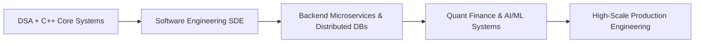

<div align="center">


# Tanmay Mangal


<p align="center">
  <a href="https://www.linkedin.com/in/tanmaymangal/">
    
  </a>
  <a href="https://leetcode.com/u/tanmay-alpha/">
    
  </a>
  <a href="mailto:mangaltanmay7@gmail.com">
    
  </a>
  <a href="https://github.com/tanmay-alpha?tab=repositories">
    
  </a>
  <a href="https://tanmay-portfolio-coral.vercel.app/">
    
  </a>
</p>

<p align="center">
  <a href="https://github.com/tanmay-alpha">
    
  </a>
  <a href="https://github.com/tanmay-alpha">
    
  </a>
  <a href="https://github.com/tanmay-alpha?tab=repositories">
    
  </a>
</p>

</div>

---

## 👨‍💻 Developer Identity & GitHub Summary

```txt
Name          : Tanmay Mangal
Role          : Computer Science Student + Software Development Engineer (SDE)
Total Commits : 1,600+ Real Engineering Commits across 18 Public Repositories
Contributions : 1,997+ Contributions (Past Year)
Streak Range  : May 7, 2026 – August 29, 2026 (115-Day Continuous Streak)
Core Stack    : C++, Python, TypeScript, Java (Spring Boot), Next.js 15, FastAPI, PostgreSQL
Location      : India
GitHub        : https://github.com/tanmay-alpha
Portfolio     : https://tanmay-portfolio-coral.vercel.app
```

I am a **Computer Science student** and **Software Development Engineer (SDE)** with **1,600+ real commits** across 18 public GitHub repositories. I specialize in high-performance C++ inference runtimes, quantitative trading engines, AI evaluation frameworks, and enterprise microservices.

---

## 🛠️ Tech Stack & Technical Skills

<div align="center">

### 💻 Languages & Core Systems
<p align="center">
  
</p>

### ⚙️ Frameworks & Backends
<p align="center">
  
</p>

### ☁️ Infrastructure & Tools
<p align="center">
  
</p>

</div>

---

## ⚡ Featured Engineering Repositories (18 Public Repos)

### 🤖 [Automated Code Review Tool](https://github.com/tanmay-alpha/automated-code-review-tool)
> **Enterprise Microservices & ML Code Audit Platform**
* **Architecture**: Distributed multi-service architecture with a Java Spring Boot API gateway, FastAPI ML worker, PostgreSQL outbox pattern, and VS Code extension.
* **Tech Stack**: `Java Spring Boot` `FastAPI` `PyTorch` `PostgreSQL` `VS Code API` `Docker`

---

### ✈️ [Flight Agent Evaluator](https://github.com/tanmay-alpha/Flight-Agent-Evaluator)
> **Deterministic Agent Benchmark & Aviation Environment**
* **Architecture**: Evaluation harness with HTTP recording/replay, multi-stage constraint verification, stateful simulated airline API, and diagnostic scorecards.
* **Tech Stack**: `Python` `FastAPI` `Pydantic` `HTTP Replay` `Pytest` `CLI`

---

### 🚀 [ONNX Inference Engine](https://github.com/tanmay-alpha/onnx-inference-engine)
> **High-Performance C++ Deep Learning Inference Core**
* **Architecture**: C++20 execution runtime implementing 20 ONNX operators, PyBind11 bindings, C ABI shared library export, Rust CLI, and Google Benchmark suite.
* **Tech Stack**: `C++20` `PyBind11` `Rust` `ONNX` `Google Benchmark` `CMake`

---

### 📈 [MAET](https://github.com/tanmay-alpha/MAET) | 🌐 [Live Demo](https://maet-pi.vercel.app)
> **Market Analytics & Execution Terminal**
* **Architecture**: Terminal for shortlisting NSE equities using corporate fundamentals, real-time price feeds, custom technical filters, and Supabase PostgreSQL.
* **Tech Stack**: `React` `FastAPI` `Supabase` `PostgreSQL` `Render` `Tailwind CSS`

---

### 📉 [Indian Algo Trading Platform](https://github.com/tanmay-alpha/indian-algo-trading-platform) | 🌐 [Live Demo](https://indian-algo-trading-platform.vercel.app)
> **Paper Trading Workspace & Execution OMS**
* **Architecture**: Paper OMS workspace for Indian equity (NSE) markets. Real-time market data streaming over WebSockets, interactive candle diagnostics, and FastAPI AI advisory microservice.
* **Tech Stack**: `Next.js 15` `FastAPI` `WebSockets` `Paper OMS` `TypeScript` `Tailwind CSS`

---

### 🧮 [FinCalc India](https://github.com/tanmay-alpha/fincalc-india) | 🌐 [Live Demo](https://fincalc-india.vercel.app)
> **Investor & Income Tax Calculator Suite**
* **Architecture**: Production-ready financial calculator suite covering SIP, Lumpsum, EMI, FD, PPF, and Old vs. New Tax regime comparisons with interactive Recharts.
* **Tech Stack**: `Next.js 15` `TypeScript` `Tailwind CSS` `Recharts`

---

### 🛡️ [Lumint Repo](https://github.com/tanmay-alpha/Lumint) | [AI Forensic Screener](https://github.com/tanmay-alpha/AI-Image-Forensic-Screener)
> **Banking Fraud & Forensic Security Systems**
* **Architecture**: Machine learning intelligence system for detecting transaction anomalies and image tampering.
* **Tech Stack**: `Python` `FastAPI` `OpenCV` `PyTorch` `Scikit-Learn`

---

### 💻 [Portfolio Website](https://tanmay-portfolio-coral.vercel.app) | [Portfolio Repo](https://github.com/tanmay-alpha/tanmay-portfolio)
> **Interactive Full-Stack SDE Portfolio**
* **Architecture**: Production portfolio website featuring interactive UI micro-animations, theme toggles, and live project demo integrations.
* **Tech Stack**: `Next.js 15` `React` `TypeScript` `Tailwind CSS` `Framer Motion`

---

## 🏆 Problem Solving & Competitive Programming

<div align="center">

<a href="https://leetcode.com/u/tanmay-alpha/">
  
</a>

</div>

---

## 📈 GitHub Activity & Performance Metrics

<div align="center">

  <a href="https://github.com/tanmay-alpha">
    
  </a>
  <a href="https://github.com/tanmay-alpha">
    
  </a>

</div>

<br/>

<div align="center">

  <a href="https://github.com/tanmay-alpha">
    
  </a>

</div>

<br/>

<div align="center">

  <a href="https://github.com/tanmay-alpha">
    
  </a>

</div>

---

## 🗺️ Engineering Path


```mermaid
flowchart LR
    A[DSA + C++ Core Systems] --> B[Software Engineering SDE]
    B --> C[Backend Microservices & Distributed DBs]
    C --> D[Quant Finance & AI/ML Systems]
    D --> E[High-Scale Production Engineering]
```

---

## 📬 Connect With Me

<div align="center">

<a href="https://www.linkedin.com/in/tanmaymangal/">
  
</a>
<a href="https://leetcode.com/u/tanmay-alpha/">
  
</a>
<a href="mailto:mangaltanmay7@gmail.com">
  
</a>
<a href="https://github.com/tanmay-alpha?tab=repositories">
  
</a>
<a href="https://tanmay-portfolio-coral.vercel.app/">
  
</a>

</div>

---

<div align="center">

*“Building scalable software, deploying intelligent models, and solving core engineering problems every day.”*


</div>
